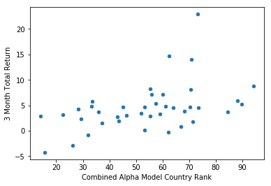

# Generating Alpha using Starmine Analytical Models - a Python example

This article will demonstrate how we can use Starmine Analytical Models to derive insight and generate alpha, in this case, for  equity markets. It is intended as a teaser to intice you to further explore this rich vein rather than a rigorous scientific study. I will be using Eikon and more specifically our new Eikon Data API to access all the data I need to conduct this analysis - however Starmine Analytics is available in other products and delivery channels. I will also provide the Jupyter notebook source via gitub. 

Pre-requisites: 

Thomson Reuters Eikon with access to new Eikon Data APIs

Python 2.x/3.x

Required Python Packages: eikon, pandas, numpy, matplotlib, sklearn, scipy

### Starmine Quantitative Analytics

In short - StarMine provides a suite of proprietary alpha-generating analytics and models spanning sectors, regions, and markets. The list of models is really broad-based and includes both quantitative analytics (such as smartEstimates) and quantitative models (such as the Combined Alpha Model I will demo here). 

All of these analytics and models can provide you with new sources of information and subsequently alpha - they are calculated by our Starmine team and delivered to you - saving you many man years of work and research etc. You can find out more about Starmine Analytics by looking at the PDF attached to this article and you can find out more about the Combined Alpha Model by viewing the short 2 min video below.


```python
from IPython.display import HTML
HTML('<iframe width="560" height="315" src="https://www.youtube.com/embed/wNVJEG9Utlo" frameborder="0" gesture="media" allow="encrypted-media" allowfullscreen></iframe>')
```


<iframe width="560" height="315" src="https://www.youtube.com/embed/wNVJEG9Utlo" frameborder="0" gesture="media" allow="encrypted-media" allowfullscreen></iframe>


### How to Access the Starmine and Other Data

As mentioned above I will be using Eikon and specifically our new Eikon Data API - which is a really easy to use yet performant web API. At the time of writing this article it is still in Beta - but all Eikon users can access it by simply upgrading their Eikon to v4.0.36+ and going to the developer portal [here](https://developers.thomsonreuters.com/eikon-data-apis) and follow instructions. If you have any questions around the API there are also monitored Q&A forums [here](https://developers.thomsonreuters.com/eikon-data-apis/qa).

Once we have access to the Eikon Data API its very straightforward to get the data we need. First lets import some packages we will need to conduct this analysis and also set our App ID (this is available from the App ID generator - see the quick start guide for further details):


```python
import eikon as ek
import pandas as pd
import numpy as np
import matplotlib.pyplot as plt
ek.set_app_id('Your App ID here')
```

Next we need to formulate our API call. In this case, I will be requesting data for all CAC-40 index constituents and I will be requesting a mixture of both Reference, Starmine Analytics and Price performance data for 8 quarters - I have made it more generic here - but essentially this is one line of code! And as you will see the API returns the data in a pandas dataframe.


```python
RICS = ['0#.FCHI']
fields =['TR.TRBCIndustryGroup','TR.CombinedAlphaCountryRank(SDate=0,EDate=-7,Frq=FQ)','TR.CombinedAlphaCountryRank(SDate=0,EDate=-7,Frq=FQ).Date',
         'TR.TotalReturn3Mo(SDate=0,EDate=-7,Frq=FQ)','TR.TotalReturn3Mo(SDate=0,EDate=-7,Frq=FQ).calcdate']

ids,err=ek.get_data(RICS,fields=fields)
ids.head(20)
```


<div>
<style scoped>
    .dataframe tbody tr th:only-of-type {
        vertical-align: middle;
    }

    .dataframe tbody tr th {
        vertical-align: top;
    }

    .dataframe thead th {
        text-align: right;
    }
</style>
<table border="1" class="dataframe">
  <thead>
    <tr style="text-align: right;">
      <th></th>
      <th>Instrument</th>
      <th>TRBC Industry Group Name</th>
      <th>Combined Alpha Model Country Rank</th>
      <th>Date</th>
      <th>3 Month Total Return</th>
      <th>Calc Date</th>
    </tr>
  </thead>
  <tbody>
    <tr>
      <th>0</th>
      <td>ACCP.PA</td>
      <td>Hotels &amp; Entertainment Services</td>
      <td>13.0</td>
      <td>2017-12-31T00:00:00Z</td>
      <td>2.295706</td>
      <td>2017-12-31</td>
    </tr>
    <tr>
      <th>1</th>
      <td>ACCP.PA</td>
      <td></td>
      <td>5.0</td>
      <td>2017-09-30T00:00:00Z</td>
      <td>2.411987</td>
      <td>2017-09-30</td>
    </tr>
    <tr>
      <th>2</th>
      <td>ACCP.PA</td>
      <td></td>
      <td>36.0</td>
      <td>2017-06-30T00:00:00Z</td>
      <td>7.890774</td>
      <td>2017-06-30</td>
    </tr>
    <tr>
      <th>3</th>
      <td>ACCP.PA</td>
      <td></td>
      <td>14.0</td>
      <td>2017-03-31T00:00:00Z</td>
      <td>10.217330</td>
      <td>2017-03-31</td>
    </tr>
    <tr>
      <th>4</th>
      <td>ACCP.PA</td>
      <td></td>
      <td>17.0</td>
      <td>2016-12-31T00:00:00Z</td>
      <td>0.339847</td>
      <td>2016-12-31</td>
    </tr>
    <tr>
      <th>5</th>
      <td>ACCP.PA</td>
      <td></td>
      <td>5.0</td>
      <td>2016-09-30T00:00:00Z</td>
      <td>1.787259</td>
      <td>2016-09-30</td>
    </tr>
    <tr>
      <th>6</th>
      <td>ACCP.PA</td>
      <td></td>
      <td>13.0</td>
      <td>2016-06-30T00:00:00Z</td>
      <td>-5.187512</td>
      <td>2016-06-30</td>
    </tr>
    <tr>
      <th>7</th>
      <td>ACCP.PA</td>
      <td></td>
      <td>9.0</td>
      <td>2016-03-31T00:00:00Z</td>
      <td>-6.911636</td>
      <td>2016-03-31</td>
    </tr>
    <tr>
      <th>8</th>
      <td>AIRP.PA</td>
      <td>Chemicals</td>
      <td>44.0</td>
      <td>2017-12-31T00:00:00Z</td>
      <td>2.396977</td>
      <td>2017-12-31</td>
    </tr>
    <tr>
      <th>9</th>
      <td>AIRP.PA</td>
      <td></td>
      <td>22.0</td>
      <td>2017-09-30T00:00:00Z</td>
      <td>4.297597</td>
      <td>2017-09-30</td>
    </tr>
    <tr>
      <th>10</th>
      <td>AIRP.PA</td>
      <td></td>
      <td>20.0</td>
      <td>2017-06-30T00:00:00Z</td>
      <td>3.664822</td>
      <td>2017-06-30</td>
    </tr>
    <tr>
      <th>11</th>
      <td>AIRP.PA</td>
      <td></td>
      <td>17.0</td>
      <td>2017-03-31T00:00:00Z</td>
      <td>1.372456</td>
      <td>2017-03-31</td>
    </tr>
    <tr>
      <th>12</th>
      <td>AIRP.PA</td>
      <td></td>
      <td>24.0</td>
      <td>2016-12-31T00:00:00Z</td>
      <td>10.686223</td>
      <td>2016-12-31</td>
    </tr>
    <tr>
      <th>13</th>
      <td>AIRP.PA</td>
      <td></td>
      <td>10.0</td>
      <td>2016-09-30T00:00:00Z</td>
      <td>4.185135</td>
      <td>2016-09-30</td>
    </tr>
    <tr>
      <th>14</th>
      <td>AIRP.PA</td>
      <td></td>
      <td>38.0</td>
      <td>2016-06-30T00:00:00Z</td>
      <td>-4.252091</td>
      <td>2016-06-30</td>
    </tr>
    <tr>
      <th>15</th>
      <td>AIRP.PA</td>
      <td></td>
      <td>26.0</td>
      <td>2016-03-31T00:00:00Z</td>
      <td>-4.592378</td>
      <td>2016-03-31</td>
    </tr>
    <tr>
      <th>16</th>
      <td>AIR.PA</td>
      <td>Aerospace &amp; Defense</td>
      <td>62.0</td>
      <td>2017-12-31T00:00:00Z</td>
      <td>3.220992</td>
      <td>2017-12-31</td>
    </tr>
    <tr>
      <th>17</th>
      <td>AIR.PA</td>
      <td></td>
      <td>25.0</td>
      <td>2017-09-30T00:00:00Z</td>
      <td>11.680556</td>
      <td>2017-09-30</td>
    </tr>
    <tr>
      <th>18</th>
      <td>AIR.PA</td>
      <td></td>
      <td>59.0</td>
      <td>2017-06-30T00:00:00Z</td>
      <td>2.453877</td>
      <td>2017-06-30</td>
    </tr>
    <tr>
      <th>19</th>
      <td>AIR.PA</td>
      <td></td>
      <td>52.0</td>
      <td>2017-03-31T00:00:00Z</td>
      <td>13.510503</td>
      <td>2017-03-31</td>
    </tr>
  </tbody>
</table>
</div>


Now that we have our data in a dataframe we may need to do some wrangling to get the types correctly set. The get_data call is the most flexible of calls so this is to be expected. We can easily check the types of data in the dataframe by column:


```python
ids.info()
```

    <class 'pandas.core.frame.DataFrame'>
    RangeIndex: 320 entries, 0 to 319
    Data columns (total 6 columns):
    Instrument                           320 non-null object
    TRBC Industry Group Name             320 non-null object
    Combined Alpha Model Country Rank    316 non-null float64
    Date                                 320 non-null object
    3 Month Total Return                 320 non-null float64
    Calc Date                            320 non-null object
    dtypes: float64(2), object(4)
    memory usage: 10.0+ KB
    

First we want to cast the Date object (a string) as a datetime type, then we want to set that datetime field as the index for the frame. Secondly, we want to make sure any numeric fields are numeric and any text fields are strings:


```python
ids['Date']=pd.to_datetime(ids['Date'])
ads=ids.set_index('Date')[['Instrument','TRBC Industry Group Name','Combined Alpha Model Country Rank','3 Month Total Return']]
ads['3 Month Total Return'] = pd.to_numeric(ads['3 Month Total Return'], errors='coerse')
ads['TRBC Industry Group Name'] = ads['TRBC Industry Group Name'].astype(str)
ads.head(10) 
```


<div>
<style scoped>
    .dataframe tbody tr th:only-of-type {
        vertical-align: middle;
    }

    .dataframe tbody tr th {
        vertical-align: top;
    }

    .dataframe thead th {
        text-align: right;
    }
</style>
<table border="1" class="dataframe">
  <thead>
    <tr style="text-align: right;">
      <th></th>
      <th>Instrument</th>
      <th>TRBC Industry Group Name</th>
      <th>Combined Alpha Model Country Rank</th>
      <th>3 Month Total Return</th>
    </tr>
    <tr>
      <th>Date</th>
      <th></th>
      <th></th>
      <th></th>
      <th></th>
    </tr>
  </thead>
  <tbody>
    <tr>
      <th>2017-12-31</th>
      <td>ACCP.PA</td>
      <td>Hotels &amp; Entertainment Services</td>
      <td>13.0</td>
      <td>2.295706</td>
    </tr>
    <tr>
      <th>2017-09-30</th>
      <td>ACCP.PA</td>
      <td></td>
      <td>5.0</td>
      <td>2.411987</td>
    </tr>
    <tr>
      <th>2017-06-30</th>
      <td>ACCP.PA</td>
      <td></td>
      <td>36.0</td>
      <td>7.890774</td>
    </tr>
    <tr>
      <th>2017-03-31</th>
      <td>ACCP.PA</td>
      <td></td>
      <td>14.0</td>
      <td>10.217330</td>
    </tr>
    <tr>
      <th>2016-12-31</th>
      <td>ACCP.PA</td>
      <td></td>
      <td>17.0</td>
      <td>0.339847</td>
    </tr>
    <tr>
      <th>2016-09-30</th>
      <td>ACCP.PA</td>
      <td></td>
      <td>5.0</td>
      <td>1.787259</td>
    </tr>
    <tr>
      <th>2016-06-30</th>
      <td>ACCP.PA</td>
      <td></td>
      <td>13.0</td>
      <td>-5.187512</td>
    </tr>
    <tr>
      <th>2016-03-31</th>
      <td>ACCP.PA</td>
      <td></td>
      <td>9.0</td>
      <td>-6.911636</td>
    </tr>
    <tr>
      <th>2017-12-31</th>
      <td>AIRP.PA</td>
      <td>Chemicals</td>
      <td>44.0</td>
      <td>2.396977</td>
    </tr>
    <tr>
      <th>2017-09-30</th>
      <td>AIRP.PA</td>
      <td></td>
      <td>22.0</td>
      <td>4.297597</td>
    </tr>
  </tbody>
</table>
</div>


```python
ads.dtypes
```


    Instrument                            object
    TRBC Industry Group Name              object
    Combined Alpha Model Country Rank    float64
    3 Month Total Return                 float64
    dtype: object


```python
ads.head()
```


<div>
<style scoped>
    .dataframe tbody tr th:only-of-type {
        vertical-align: middle;
    }

    .dataframe tbody tr th {
        vertical-align: top;
    }

    .dataframe thead th {
        text-align: right;
    }
</style>
<table border="1" class="dataframe">
  <thead>
    <tr style="text-align: right;">
      <th></th>
      <th>Instrument</th>
      <th>TRBC Industry Group Name</th>
      <th>Combined Alpha Model Country Rank</th>
      <th>3 Month Total Return</th>
    </tr>
    <tr>
      <th>Date</th>
      <th></th>
      <th></th>
      <th></th>
      <th></th>
    </tr>
  </thead>
  <tbody>
    <tr>
      <th>2017-12-31</th>
      <td>ACCP.PA</td>
      <td>Hotels &amp; Entertainment Services</td>
      <td>13.0</td>
      <td>2.295706</td>
    </tr>
    <tr>
      <th>2017-09-30</th>
      <td>ACCP.PA</td>
      <td></td>
      <td>5.0</td>
      <td>2.411987</td>
    </tr>
    <tr>
      <th>2017-06-30</th>
      <td>ACCP.PA</td>
      <td></td>
      <td>36.0</td>
      <td>7.890774</td>
    </tr>
    <tr>
      <th>2017-03-31</th>
      <td>ACCP.PA</td>
      <td></td>
      <td>14.0</td>
      <td>10.217330</td>
    </tr>
    <tr>
      <th>2016-12-31</th>
      <td>ACCP.PA</td>
      <td></td>
      <td>17.0</td>
      <td>0.339847</td>
    </tr>
  </tbody>
</table>
</div>


A bit more wrangling is required here as we can see for example that the API has returned the TRBC Industry Group only for the most current instance of each instrument - not for the historical quarters. We can recitfy this easily in 2 lines of code. First we will replace blanks with nan (not a number). We can then use the excellent and surgical fillna dataframe function to fill the Sector name to the historic quarters: 


```python
ads1 = ads.replace('', np.nan, regex=True)
```


```python
ads1['TRBC Industry Group Name'].fillna(method='ffill',limit=7, inplace=True)
ads1.head(15)
```


<div>
<style scoped>
    .dataframe tbody tr th:only-of-type {
        vertical-align: middle;
    }

    .dataframe tbody tr th {
        vertical-align: top;
    }

    .dataframe thead th {
        text-align: right;
    }
</style>
<table border="1" class="dataframe">
  <thead>
    <tr style="text-align: right;">
      <th></th>
      <th>Instrument</th>
      <th>TRBC Industry Group Name</th>
      <th>Combined Alpha Model Country Rank</th>
      <th>3 Month Total Return</th>
    </tr>
    <tr>
      <th>Date</th>
      <th></th>
      <th></th>
      <th></th>
      <th></th>
    </tr>
  </thead>
  <tbody>
    <tr>
      <th>2017-12-31</th>
      <td>ACCP.PA</td>
      <td>Hotels &amp; Entertainment Services</td>
      <td>13.0</td>
      <td>2.295706</td>
    </tr>
    <tr>
      <th>2017-09-30</th>
      <td>ACCP.PA</td>
      <td>Hotels &amp; Entertainment Services</td>
      <td>5.0</td>
      <td>2.411987</td>
    </tr>
    <tr>
      <th>2017-06-30</th>
      <td>ACCP.PA</td>
      <td>Hotels &amp; Entertainment Services</td>
      <td>36.0</td>
      <td>7.890774</td>
    </tr>
    <tr>
      <th>2017-03-31</th>
      <td>ACCP.PA</td>
      <td>Hotels &amp; Entertainment Services</td>
      <td>14.0</td>
      <td>10.217330</td>
    </tr>
    <tr>
      <th>2016-12-31</th>
      <td>ACCP.PA</td>
      <td>Hotels &amp; Entertainment Services</td>
      <td>17.0</td>
      <td>0.339847</td>
    </tr>
    <tr>
      <th>2016-09-30</th>
      <td>ACCP.PA</td>
      <td>Hotels &amp; Entertainment Services</td>
      <td>5.0</td>
      <td>1.787259</td>
    </tr>
    <tr>
      <th>2016-06-30</th>
      <td>ACCP.PA</td>
      <td>Hotels &amp; Entertainment Services</td>
      <td>13.0</td>
      <td>-5.187512</td>
    </tr>
    <tr>
      <th>2016-03-31</th>
      <td>ACCP.PA</td>
      <td>Hotels &amp; Entertainment Services</td>
      <td>9.0</td>
      <td>-6.911636</td>
    </tr>
    <tr>
      <th>2017-12-31</th>
      <td>AIRP.PA</td>
      <td>Chemicals</td>
      <td>44.0</td>
      <td>2.396977</td>
    </tr>
    <tr>
      <th>2017-09-30</th>
      <td>AIRP.PA</td>
      <td>Chemicals</td>
      <td>22.0</td>
      <td>4.297597</td>
    </tr>
    <tr>
      <th>2017-06-30</th>
      <td>AIRP.PA</td>
      <td>Chemicals</td>
      <td>20.0</td>
      <td>3.664822</td>
    </tr>
    <tr>
      <th>2017-03-31</th>
      <td>AIRP.PA</td>
      <td>Chemicals</td>
      <td>17.0</td>
      <td>1.372456</td>
    </tr>
    <tr>
      <th>2016-12-31</th>
      <td>AIRP.PA</td>
      <td>Chemicals</td>
      <td>24.0</td>
      <td>10.686223</td>
    </tr>
    <tr>
      <th>2016-09-30</th>
      <td>AIRP.PA</td>
      <td>Chemicals</td>
      <td>10.0</td>
      <td>4.185135</td>
    </tr>
    <tr>
      <th>2016-06-30</th>
      <td>AIRP.PA</td>
      <td>Chemicals</td>
      <td>38.0</td>
      <td>-4.252091</td>
    </tr>
  </tbody>
</table>
</div>


We now need to shift the 3 Month Total Return column down by 1 so we can map CAM ranks to forward looking performance. Thankfully in pandas this is trivial and note the Groupby instrument clause.


```python
ads1['3 Month Total Return'] = ads1.groupby('Instrument')['3 Month Total Return'].shift()
```


```python
ads1.head(15)
```


<div>
<style scoped>
    .dataframe tbody tr th:only-of-type {
        vertical-align: middle;
    }

    .dataframe tbody tr th {
        vertical-align: top;
    }

    .dataframe thead th {
        text-align: right;
    }
</style>
<table border="1" class="dataframe">
  <thead>
    <tr style="text-align: right;">
      <th></th>
      <th>Instrument</th>
      <th>TRBC Industry Group Name</th>
      <th>Combined Alpha Model Country Rank</th>
      <th>3 Month Total Return</th>
    </tr>
    <tr>
      <th>Date</th>
      <th></th>
      <th></th>
      <th></th>
      <th></th>
    </tr>
  </thead>
  <tbody>
    <tr>
      <th>2017-12-31</th>
      <td>ACCP.PA</td>
      <td>Hotels &amp; Entertainment Services</td>
      <td>13.0</td>
      <td>NaN</td>
    </tr>
    <tr>
      <th>2017-09-30</th>
      <td>ACCP.PA</td>
      <td>Hotels &amp; Entertainment Services</td>
      <td>5.0</td>
      <td>2.295706</td>
    </tr>
    <tr>
      <th>2017-06-30</th>
      <td>ACCP.PA</td>
      <td>Hotels &amp; Entertainment Services</td>
      <td>36.0</td>
      <td>2.411987</td>
    </tr>
    <tr>
      <th>2017-03-31</th>
      <td>ACCP.PA</td>
      <td>Hotels &amp; Entertainment Services</td>
      <td>14.0</td>
      <td>7.890774</td>
    </tr>
    <tr>
      <th>2016-12-31</th>
      <td>ACCP.PA</td>
      <td>Hotels &amp; Entertainment Services</td>
      <td>17.0</td>
      <td>10.217330</td>
    </tr>
    <tr>
      <th>2016-09-30</th>
      <td>ACCP.PA</td>
      <td>Hotels &amp; Entertainment Services</td>
      <td>5.0</td>
      <td>0.339847</td>
    </tr>
    <tr>
      <th>2016-06-30</th>
      <td>ACCP.PA</td>
      <td>Hotels &amp; Entertainment Services</td>
      <td>13.0</td>
      <td>1.787259</td>
    </tr>
    <tr>
      <th>2016-03-31</th>
      <td>ACCP.PA</td>
      <td>Hotels &amp; Entertainment Services</td>
      <td>9.0</td>
      <td>-5.187512</td>
    </tr>
    <tr>
      <th>2017-12-31</th>
      <td>AIRP.PA</td>
      <td>Chemicals</td>
      <td>44.0</td>
      <td>NaN</td>
    </tr>
    <tr>
      <th>2017-09-30</th>
      <td>AIRP.PA</td>
      <td>Chemicals</td>
      <td>22.0</td>
      <td>2.396977</td>
    </tr>
    <tr>
      <th>2017-06-30</th>
      <td>AIRP.PA</td>
      <td>Chemicals</td>
      <td>20.0</td>
      <td>4.297597</td>
    </tr>
    <tr>
      <th>2017-03-31</th>
      <td>AIRP.PA</td>
      <td>Chemicals</td>
      <td>17.0</td>
      <td>3.664822</td>
    </tr>
    <tr>
      <th>2016-12-31</th>
      <td>AIRP.PA</td>
      <td>Chemicals</td>
      <td>24.0</td>
      <td>1.372456</td>
    </tr>
    <tr>
      <th>2016-09-30</th>
      <td>AIRP.PA</td>
      <td>Chemicals</td>
      <td>10.0</td>
      <td>10.686223</td>
    </tr>
    <tr>
      <th>2016-06-30</th>
      <td>AIRP.PA</td>
      <td>Chemicals</td>
      <td>38.0</td>
      <td>4.185135</td>
    </tr>
  </tbody>
</table>
</div>


```python
ads1.info()
```

    <class 'pandas.core.frame.DataFrame'>
    DatetimeIndex: 320 entries, 2017-12-31 to 2016-03-31
    Data columns (total 4 columns):
    Instrument                           320 non-null object
    TRBC Industry Group Name             320 non-null object
    Combined Alpha Model Country Rank    316 non-null float64
    3 Month Total Return                 280 non-null float64
    dtypes: float64(2), object(2)
    memory usage: 10.0+ KB
    


```python
ads1.dropna(axis=0, how='any', inplace=True)
ads1.head(20)
```


<div>
<style scoped>
    .dataframe tbody tr th:only-of-type {
        vertical-align: middle;
    }

    .dataframe tbody tr th {
        vertical-align: top;
    }

    .dataframe thead th {
        text-align: right;
    }
</style>
<table border="1" class="dataframe">
  <thead>
    <tr style="text-align: right;">
      <th></th>
      <th>Instrument</th>
      <th>TRBC Industry Group Name</th>
      <th>Combined Alpha Model Country Rank</th>
      <th>3 Month Total Return</th>
    </tr>
    <tr>
      <th>Date</th>
      <th></th>
      <th></th>
      <th></th>
      <th></th>
    </tr>
  </thead>
  <tbody>
    <tr>
      <th>2017-09-30</th>
      <td>ACCP.PA</td>
      <td>Hotels &amp; Entertainment Services</td>
      <td>5.0</td>
      <td>2.295706</td>
    </tr>
    <tr>
      <th>2017-06-30</th>
      <td>ACCP.PA</td>
      <td>Hotels &amp; Entertainment Services</td>
      <td>36.0</td>
      <td>2.411987</td>
    </tr>
    <tr>
      <th>2017-03-31</th>
      <td>ACCP.PA</td>
      <td>Hotels &amp; Entertainment Services</td>
      <td>14.0</td>
      <td>7.890774</td>
    </tr>
    <tr>
      <th>2016-12-31</th>
      <td>ACCP.PA</td>
      <td>Hotels &amp; Entertainment Services</td>
      <td>17.0</td>
      <td>10.217330</td>
    </tr>
    <tr>
      <th>2016-09-30</th>
      <td>ACCP.PA</td>
      <td>Hotels &amp; Entertainment Services</td>
      <td>5.0</td>
      <td>0.339847</td>
    </tr>
    <tr>
      <th>2016-06-30</th>
      <td>ACCP.PA</td>
      <td>Hotels &amp; Entertainment Services</td>
      <td>13.0</td>
      <td>1.787259</td>
    </tr>
    <tr>
      <th>2016-03-31</th>
      <td>ACCP.PA</td>
      <td>Hotels &amp; Entertainment Services</td>
      <td>9.0</td>
      <td>-5.187512</td>
    </tr>
    <tr>
      <th>2017-09-30</th>
      <td>AIRP.PA</td>
      <td>Chemicals</td>
      <td>22.0</td>
      <td>2.396977</td>
    </tr>
    <tr>
      <th>2017-06-30</th>
      <td>AIRP.PA</td>
      <td>Chemicals</td>
      <td>20.0</td>
      <td>4.297597</td>
    </tr>
    <tr>
      <th>2017-03-31</th>
      <td>AIRP.PA</td>
      <td>Chemicals</td>
      <td>17.0</td>
      <td>3.664822</td>
    </tr>
    <tr>
      <th>2016-12-31</th>
      <td>AIRP.PA</td>
      <td>Chemicals</td>
      <td>24.0</td>
      <td>1.372456</td>
    </tr>
    <tr>
      <th>2016-09-30</th>
      <td>AIRP.PA</td>
      <td>Chemicals</td>
      <td>10.0</td>
      <td>10.686223</td>
    </tr>
    <tr>
      <th>2016-06-30</th>
      <td>AIRP.PA</td>
      <td>Chemicals</td>
      <td>38.0</td>
      <td>4.185135</td>
    </tr>
    <tr>
      <th>2016-03-31</th>
      <td>AIRP.PA</td>
      <td>Chemicals</td>
      <td>26.0</td>
      <td>-4.252091</td>
    </tr>
    <tr>
      <th>2017-09-30</th>
      <td>AIR.PA</td>
      <td>Aerospace &amp; Defense</td>
      <td>25.0</td>
      <td>3.220992</td>
    </tr>
    <tr>
      <th>2017-06-30</th>
      <td>AIR.PA</td>
      <td>Aerospace &amp; Defense</td>
      <td>59.0</td>
      <td>11.680556</td>
    </tr>
    <tr>
      <th>2017-03-31</th>
      <td>AIR.PA</td>
      <td>Aerospace &amp; Defense</td>
      <td>52.0</td>
      <td>2.453877</td>
    </tr>
    <tr>
      <th>2016-12-31</th>
      <td>AIR.PA</td>
      <td>Aerospace &amp; Defense</td>
      <td>14.0</td>
      <td>13.510503</td>
    </tr>
    <tr>
      <th>2016-09-30</th>
      <td>AIR.PA</td>
      <td>Aerospace &amp; Defense</td>
      <td>13.0</td>
      <td>16.716196</td>
    </tr>
    <tr>
      <th>2016-06-30</th>
      <td>AIR.PA</td>
      <td>Aerospace &amp; Defense</td>
      <td>22.0</td>
      <td>4.078871</td>
    </tr>
  </tbody>
</table>
</div>


So now our Dataframe is seemingly in good shape - what are we going to do next? We can start with the question do higher CAM score leads to better performance? Or put more generically, are CAM scores RELATED to performance? Remember these CAM scores are dynamic and change overtime depending on changes in their underlying components AND relative to other companies in the universe (in this case companies in the same country). 

So lets just see what this looks like in terms of a scatterplot for one sector of the CAC-40. Here we are just filtering the frame using a text filter and aggregating using a groupby statement. In this case we have 2 companies.


```python
%matplotlib inline
adsl = ads1[ads1['TRBC Industry Group Name'] =='Industrial Conglomerates']
adsl = adsl.groupby('Instrument')
ax = adsl.plot(x='Combined Alpha Model Country Rank', y='3 Month Total Return', kind='scatter')
```

So lets be clear about what we are looking at. Each dot represents a pair of observations for CAM rank and 3M total return for a quarter - we should have 7 quarters of observations for each instrument. So we could implement a simple linear regression and that would have different parameters such as intercept, slope. 

As I am in exploratory mode - I just am interested in the slope of the best fit linear line (of the form y = ax + b), where a is the slope coefficient. This should offer me some indication of how 3 Month total returns change for an increase in CAM rank. So our slope coefficient can tell us for example whether our variables are positively related (positive a) or negatively related (negative a) or really not related at all (near zero a). 

We can also more formally calculate Spearman's Rank Correlation Coefficient which will give us a more rigorous measure of relatedness and also a probability that the null hypothesis (the two variables are not related) is true.

So rather than create plots for everything we can just create a model to provide the linear best fit solution for each instrument and then store that value in a new column as well as calculating the Spearman's Rank Correlation Coefficient and p-value. 

First, I want to check for if any data is null as this may result in errors downstream.


```python
ads1.isnull().any().count()
```


    4


Here we can see there are 4 null values in our dataset - we can deal with these by replacing them with either mean values or most recent values. In our case, I choose the latter and will use a forward fill function to replace nulls: 


```python
adsNN = ads1.fillna(method='ffill')
```


```python
adsNN.isnull().any()
```


    Instrument                           False
    TRBC Industry Group Name             False
    Combined Alpha Model Country Rank    False
    3 Month Total Return                 False
    dtype: bool


Now we have confirmed we have no null values we can move on. Next we will use the Linear Regression model from the Linear Model tools from Scikit Learn package. We want to solve for 7 quarters of data for each Instrument. So we iterate over each intrument then use the model.fit method to generate the best fit linear solution (OLS) and then store the 'coef_' parameter of the model as a new column in the adsNN dataframe called 'slope'. 

Whilst we are here we will also calculate a Spearman's Rank Correlation Coefficient using a routine from scipy package. The routine returns 2 values, the first is the Coefficient (Rho) and the second is the p-value. I just store these 2 elements in 2 seperate columns.


```python
import sklearn
import scipy
from sklearn import linear_model
model = linear_model.LinearRegression()
for (group, adsNN_gp) in adsNN.groupby('Instrument'):
    X=adsNN_gp[['Combined Alpha Model Country Rank']]
    y=adsNN_gp[['3 Month Total Return']]
    model.fit(X,y)
    spearmans = scipy.stats.spearmanr(X,y)
    adsNN.loc[adsNN.Instrument == adsNN_gp.iloc[0].Instrument, 'slope'] = model.coef_
    adsNN.loc[adsNN.Instrument == adsNN_gp.iloc[0].Instrument, 'Rho'] = spearmans[0]
    adsNN.loc[adsNN.Instrument == adsNN_gp.iloc[0].Instrument, 'p'] = spearmans[1]

adsNN.head(15)
```


<div>
<style scoped>
    .dataframe tbody tr th:only-of-type {
        vertical-align: middle;
    }

    .dataframe tbody tr th {
        vertical-align: top;
    }

    .dataframe thead th {
        text-align: right;
    }
</style>
<table border="1" class="dataframe">
  <thead>
    <tr style="text-align: right;">
      <th></th>
      <th>Instrument</th>
      <th>TRBC Industry Group Name</th>
      <th>Combined Alpha Model Country Rank</th>
      <th>3 Month Total Return</th>
      <th>slope</th>
      <th>Rho</th>
      <th>p</th>
    </tr>
    <tr>
      <th>Date</th>
      <th></th>
      <th></th>
      <th></th>
      <th></th>
      <th></th>
      <th></th>
      <th></th>
    </tr>
  </thead>
  <tbody>
    <tr>
      <th>2017-09-30</th>
      <td>ACCP.PA</td>
      <td>Hotels &amp; Entertainment Services</td>
      <td>5.0</td>
      <td>2.295706</td>
      <td>0.119443</td>
      <td>0.684712</td>
      <td>0.089666</td>
    </tr>
    <tr>
      <th>2017-06-30</th>
      <td>ACCP.PA</td>
      <td>Hotels &amp; Entertainment Services</td>
      <td>36.0</td>
      <td>2.411987</td>
      <td>0.119443</td>
      <td>0.684712</td>
      <td>0.089666</td>
    </tr>
    <tr>
      <th>2017-03-31</th>
      <td>ACCP.PA</td>
      <td>Hotels &amp; Entertainment Services</td>
      <td>14.0</td>
      <td>7.890774</td>
      <td>0.119443</td>
      <td>0.684712</td>
      <td>0.089666</td>
    </tr>
    <tr>
      <th>2016-12-31</th>
      <td>ACCP.PA</td>
      <td>Hotels &amp; Entertainment Services</td>
      <td>17.0</td>
      <td>10.217330</td>
      <td>0.119443</td>
      <td>0.684712</td>
      <td>0.089666</td>
    </tr>
    <tr>
      <th>2016-09-30</th>
      <td>ACCP.PA</td>
      <td>Hotels &amp; Entertainment Services</td>
      <td>5.0</td>
      <td>0.339847</td>
      <td>0.119443</td>
      <td>0.684712</td>
      <td>0.089666</td>
    </tr>
    <tr>
      <th>2016-06-30</th>
      <td>ACCP.PA</td>
      <td>Hotels &amp; Entertainment Services</td>
      <td>13.0</td>
      <td>1.787259</td>
      <td>0.119443</td>
      <td>0.684712</td>
      <td>0.089666</td>
    </tr>
    <tr>
      <th>2016-03-31</th>
      <td>ACCP.PA</td>
      <td>Hotels &amp; Entertainment Services</td>
      <td>9.0</td>
      <td>-5.187512</td>
      <td>0.119443</td>
      <td>0.684712</td>
      <td>0.089666</td>
    </tr>
    <tr>
      <th>2017-09-30</th>
      <td>AIRP.PA</td>
      <td>Chemicals</td>
      <td>22.0</td>
      <td>2.396977</td>
      <td>-0.250236</td>
      <td>-0.571429</td>
      <td>0.180202</td>
    </tr>
    <tr>
      <th>2017-06-30</th>
      <td>AIRP.PA</td>
      <td>Chemicals</td>
      <td>20.0</td>
      <td>4.297597</td>
      <td>-0.250236</td>
      <td>-0.571429</td>
      <td>0.180202</td>
    </tr>
    <tr>
      <th>2017-03-31</th>
      <td>AIRP.PA</td>
      <td>Chemicals</td>
      <td>17.0</td>
      <td>3.664822</td>
      <td>-0.250236</td>
      <td>-0.571429</td>
      <td>0.180202</td>
    </tr>
    <tr>
      <th>2016-12-31</th>
      <td>AIRP.PA</td>
      <td>Chemicals</td>
      <td>24.0</td>
      <td>1.372456</td>
      <td>-0.250236</td>
      <td>-0.571429</td>
      <td>0.180202</td>
    </tr>
    <tr>
      <th>2016-09-30</th>
      <td>AIRP.PA</td>
      <td>Chemicals</td>
      <td>10.0</td>
      <td>10.686223</td>
      <td>-0.250236</td>
      <td>-0.571429</td>
      <td>0.180202</td>
    </tr>
    <tr>
      <th>2016-06-30</th>
      <td>AIRP.PA</td>
      <td>Chemicals</td>
      <td>38.0</td>
      <td>4.185135</td>
      <td>-0.250236</td>
      <td>-0.571429</td>
      <td>0.180202</td>
    </tr>
    <tr>
      <th>2016-03-31</th>
      <td>AIRP.PA</td>
      <td>Chemicals</td>
      <td>26.0</td>
      <td>-4.252091</td>
      <td>-0.250236</td>
      <td>-0.571429</td>
      <td>0.180202</td>
    </tr>
    <tr>
      <th>2017-09-30</th>
      <td>AIR.PA</td>
      <td>Aerospace &amp; Defense</td>
      <td>25.0</td>
      <td>3.220992</td>
      <td>-0.234564</td>
      <td>-0.607143</td>
      <td>0.148231</td>
    </tr>
  </tbody>
</table>
</div>


Voila - I have all the calculations I requested and I think I just want to average these by Instrument so I can get a summary view. (note averaging the slope, Rho and p values does not change them as they were calculated once for the 7 periods and just copied 7 times). 


```python
Averages = adsNN.groupby(['Instrument']).mean()
Averages
```


<div>
<style scoped>
    .dataframe tbody tr th:only-of-type {
        vertical-align: middle;
    }

    .dataframe tbody tr th {
        vertical-align: top;
    }

    .dataframe thead th {
        text-align: right;
    }
</style>
<table border="1" class="dataframe">
  <thead>
    <tr style="text-align: right;">
      <th></th>
      <th>Combined Alpha Model Country Rank</th>
      <th>3 Month Total Return</th>
      <th>slope</th>
      <th>Rho</th>
      <th>p</th>
    </tr>
    <tr>
      <th>Instrument</th>
      <th></th>
      <th></th>
      <th></th>
      <th></th>
      <th></th>
    </tr>
  </thead>
  <tbody>
    <tr>
      <th>ACCP.PA</th>
      <td>14.142857</td>
      <td>2.822199</td>
      <td>0.119443</td>
      <td>0.684712</td>
      <td>0.089666</td>
    </tr>
    <tr>
      <th>AIR.PA</th>
      <td>33.571429</td>
      <td>5.714654</td>
      <td>-0.234564</td>
      <td>-0.607143</td>
      <td>0.148231</td>
    </tr>
    <tr>
      <th>AIRP.PA</th>
      <td>22.428571</td>
      <td>3.193017</td>
      <td>-0.250236</td>
      <td>-0.571429</td>
      <td>0.180202</td>
    </tr>
    <tr>
      <th>ATOS.PA</th>
      <td>94.142857</td>
      <td>8.784536</td>
      <td>-0.743983</td>
      <td>-0.054056</td>
      <td>0.908365</td>
    </tr>
    <tr>
      <th>AXAF.PA</th>
      <td>64.000000</td>
      <td>4.571939</td>
      <td>-0.196042</td>
      <td>-0.126131</td>
      <td>0.787572</td>
    </tr>
    <tr>
      <th>BNPP.PA</th>
      <td>60.142857</td>
      <td>7.160401</td>
      <td>-0.079672</td>
      <td>-0.252262</td>
      <td>0.585241</td>
    </tr>
    <tr>
      <th>BOUY.PA</th>
      <td>73.428571</td>
      <td>4.506075</td>
      <td>-0.323423</td>
      <td>-0.500000</td>
      <td>0.253170</td>
    </tr>
    <tr>
      <th>CAGR.PA</th>
      <td>55.285714</td>
      <td>8.206785</td>
      <td>-0.066242</td>
      <td>0.142857</td>
      <td>0.759945</td>
    </tr>
    <tr>
      <th>CAPP.PA</th>
      <td>59.142857</td>
      <td>3.231260</td>
      <td>-0.358011</td>
      <td>-0.535714</td>
      <td>0.215217</td>
    </tr>
    <tr>
      <th>CARR.PA</th>
      <td>26.285714</td>
      <td>-2.853468</td>
      <td>0.209579</td>
      <td>-0.107143</td>
      <td>0.819151</td>
    </tr>
    <tr>
      <th>DANO.PA</th>
      <td>29.428571</td>
      <td>2.312771</td>
      <td>0.070155</td>
      <td>0.142857</td>
      <td>0.759945</td>
    </tr>
    <tr>
      <th>ENGIE.PA</th>
      <td>46.428571</td>
      <td>2.994981</td>
      <td>-0.117695</td>
      <td>-0.450469</td>
      <td>0.310429</td>
    </tr>
    <tr>
      <th>ESSI.PA</th>
      <td>37.285714</td>
      <td>1.446916</td>
      <td>-0.205101</td>
      <td>-0.392857</td>
      <td>0.383317</td>
    </tr>
    <tr>
      <th>EXHO.PA</th>
      <td>55.428571</td>
      <td>2.871624</td>
      <td>-0.066887</td>
      <td>-0.540562</td>
      <td>0.210289</td>
    </tr>
    <tr>
      <th>FTI.PA</th>
      <td>15.666667</td>
      <td>-4.249451</td>
      <td>-0.995839</td>
      <td>-1.000000</td>
      <td>0.000000</td>
    </tr>
    <tr>
      <th>LEGD.PA</th>
      <td>45.142857</td>
      <td>4.603834</td>
      <td>-0.017527</td>
      <td>-0.035714</td>
      <td>0.939408</td>
    </tr>
    <tr>
      <th>LHN.PA</th>
      <td>35.857143</td>
      <td>3.710595</td>
      <td>-0.248977</td>
      <td>-0.214286</td>
      <td>0.644512</td>
    </tr>
    <tr>
      <th>LVMH.PA</th>
      <td>70.571429</td>
      <td>8.080266</td>
      <td>-0.167705</td>
      <td>-0.250000</td>
      <td>0.588724</td>
    </tr>
    <tr>
      <th>MICP.PA</th>
      <td>89.857143</td>
      <td>5.207835</td>
      <td>0.584094</td>
      <td>0.630656</td>
      <td>0.128888</td>
    </tr>
    <tr>
      <th>MT.AS</th>
      <td>70.857143</td>
      <td>13.962780</td>
      <td>0.107790</td>
      <td>0.198206</td>
      <td>0.670085</td>
    </tr>
    <tr>
      <th>ORAN.PA</th>
      <td>53.142857</td>
      <td>0.186049</td>
      <td>-0.193575</td>
      <td>-0.846881</td>
      <td>0.016197</td>
    </tr>
    <tr>
      <th>OREP.PA</th>
      <td>43.000000</td>
      <td>2.721421</td>
      <td>0.055467</td>
      <td>0.642857</td>
      <td>0.119392</td>
    </tr>
    <tr>
      <th>PERP.PA</th>
      <td>33.285714</td>
      <td>4.797600</td>
      <td>-0.066685</td>
      <td>-0.071429</td>
      <td>0.879048</td>
    </tr>
    <tr>
      <th>PEUP.PA</th>
      <td>84.428571</td>
      <td>3.700341</td>
      <td>-0.261221</td>
      <td>-0.214286</td>
      <td>0.644512</td>
    </tr>
    <tr>
      <th>PRTP.PA</th>
      <td>62.428571</td>
      <td>14.708734</td>
      <td>-0.008738</td>
      <td>-0.018019</td>
      <td>0.969415</td>
    </tr>
    <tr>
      <th>PUBP.PA</th>
      <td>62.142857</td>
      <td>-0.332859</td>
      <td>0.155443</td>
      <td>0.321429</td>
      <td>0.482072</td>
    </tr>
    <tr>
      <th>RENA.PA</th>
      <td>67.000000</td>
      <td>0.840024</td>
      <td>-0.286120</td>
      <td>-0.054056</td>
      <td>0.908365</td>
    </tr>
    <tr>
      <th>SAF.PA</th>
      <td>57.571429</td>
      <td>5.371726</td>
      <td>-0.176439</td>
      <td>-0.357143</td>
      <td>0.431611</td>
    </tr>
    <tr>
      <th>SASY.PA</th>
      <td>71.285714</td>
      <td>1.715126</td>
      <td>-0.241940</td>
      <td>-0.285714</td>
      <td>0.534509</td>
    </tr>
    <tr>
      <th>SCHN.PA</th>
      <td>53.142857</td>
      <td>4.601030</td>
      <td>-0.002400</td>
      <td>0.214286</td>
      <td>0.644512</td>
    </tr>
    <tr>
      <th>SGEF.PA</th>
      <td>70.285714</td>
      <td>4.670457</td>
      <td>-0.264057</td>
      <td>-0.714286</td>
      <td>0.071344</td>
    </tr>
    <tr>
      <th>SGOB.PA</th>
      <td>68.285714</td>
      <td>3.861674</td>
      <td>0.131461</td>
      <td>0.000000</td>
      <td>1.000000</td>
    </tr>
    <tr>
      <th>SOGN.PA</th>
      <td>55.857143</td>
      <td>7.180684</td>
      <td>0.029665</td>
      <td>0.000000</td>
      <td>1.000000</td>
    </tr>
    <tr>
      <th>SOLB.BR</th>
      <td>61.142857</td>
      <td>4.775618</td>
      <td>-0.236724</td>
      <td>-0.250000</td>
      <td>0.588724</td>
    </tr>
    <tr>
      <th>STM.PA</th>
      <td>73.285714</td>
      <td>22.908329</td>
      <td>-0.388359</td>
      <td>-0.535714</td>
      <td>0.215217</td>
    </tr>
    <tr>
      <th>TOTF.PA</th>
      <td>51.857143</td>
      <td>3.422500</td>
      <td>-0.031798</td>
      <td>-0.185312</td>
      <td>0.690778</td>
    </tr>
    <tr>
      <th>UNBP.AS</th>
      <td>32.000000</td>
      <td>-0.891114</td>
      <td>-0.095466</td>
      <td>-0.071429</td>
      <td>0.879048</td>
    </tr>
    <tr>
      <th>VIE.PA</th>
      <td>43.428571</td>
      <td>1.959539</td>
      <td>-0.331911</td>
      <td>-0.828862</td>
      <td>0.021174</td>
    </tr>
    <tr>
      <th>VIV.PA</th>
      <td>28.285714</td>
      <td>4.241614</td>
      <td>-0.079870</td>
      <td>-0.250000</td>
      <td>0.588724</td>
    </tr>
    <tr>
      <th>VLOF.PA</th>
      <td>88.142857</td>
      <td>5.843416</td>
      <td>0.022018</td>
      <td>-0.306319</td>
      <td>0.504027</td>
    </tr>
  </tbody>
</table>
</div>


### Conclusion

So now we have a summarised view of our study - can we answer the question posited earlier? 'Are CAM scores RELATED to performance?' Let us have a look at average CAM score versus average 3 month total return (over 7 quarters). This seems to indicate that there is a positive relation between the two variables.


```python
ax = Averages.plot(x='Combined Alpha Model Country Rank', y='3 Month Total Return', kind='scatter')
```





We can check this further by running the same Spearman's Rank Correlation Coefficient test against these summary results. Here we can see Rho of 50 which is both large & positive and with p of 0.101 the null hypothesis can be safetly rejected. 


```python
spearmans = scipy.stats.spearmanr(Averages['Combined Alpha Model Country Rank'],Averages['3 Month Total Return'])
Rho = spearmans[0]
p = spearmans[1]
print(Rho,p)
```

    0.5003048928999382 0.001010764442996582
    
